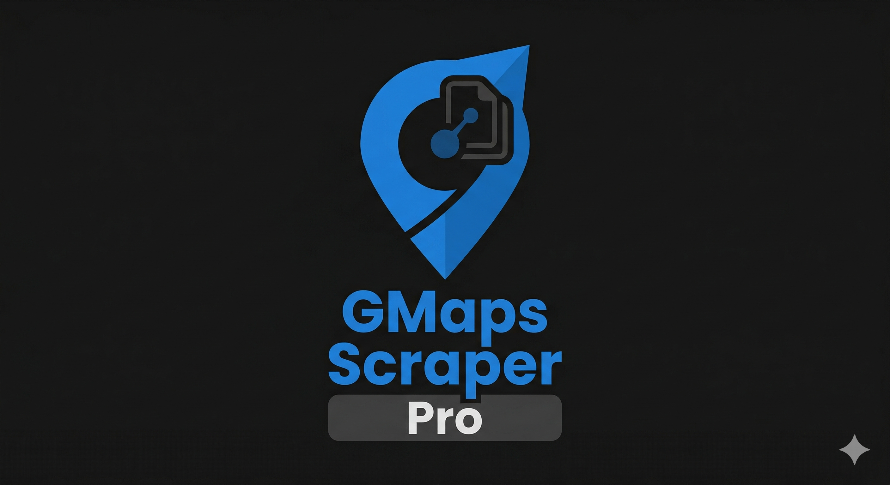

# GMaps Scraper Pro

A Google Chrome Extension that automatically scrapes business data from Google Maps search results. It saves you time by pulling all the contact details into an easy-to-use CSV spreadsheet or a clean PDF report.

## What it does

- **Hands-Free Scraping**: It automatically clicks through Google Maps search results to find contact info.
- **Grabs Everything You Need**:
  - Business Name
  - Phone Number
  - Website Link
  - Address
  - **Rating & Total Reviews** (Smart enough to find reviews even if Google changes its layout)
  - Business Category
- **Two Ways to Export**:
  - **Download CSV**: Gets you a perfect `.csv` file you can edit straight in Microsoft Excel or Google Sheets.
  - **Download PDF**: Instantly creates a clean, printable PDF table of the businesses you found.
- **Stays Hidden**: Uses random, small delays between clicks so Google Maps doesn't think you're a robot.
- **Saves Your Progress**: Your scraped data stays safe in the extension until you click "Clear Data".

## How to Install

1. Download or clone this folder to your computer.
2. Open Chrome and go to the Extensions page (`chrome://extensions/`).
3. Turn on the **Developer Mode** switch in the top right.
4. Click the **Load unpacked** button in the top left.
5. Select the folder where you saved this project.
6. The extension is now installed! Click the puzzle icon to pin it to your toolbar.

## How to Use

1. Go to [Google Maps](https://www.google.com/maps).
2. Search for anything you want (for example, `Restaurants in Islamabad` or `Plumbers near me`).
3. Open the **GMaps Scraper Pro** extension from your toolbar.
4. Choose how many results you want to scrape.
5. Click **Start Scraping**.
6. The extension will show you a live log of what it's clicking and saving.
7. Click **Export CSV** or **Export PDF** to download your new leads!

## Built With

- Vanilla JavaScript
- Modern CSS
- Chrome Extension Manifest V3
- jsPDF

## Author

**Zulkifal Khan**

## License

This project is free to use under the MIT License.
